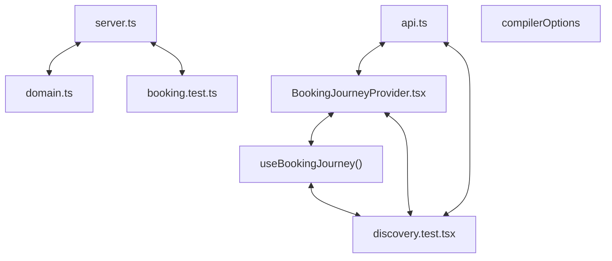

# Codebase Architectural Report

> **Auto-generated** by graphify knowledge graph analysis  
> **Purpose**: Dependency map, connection analysis, subsystem breakdown, and quality hotspots.

---

## 1. Executive Summary

- **Total Components**: `293`
- **Total Connections**: `495`
- **Subsystem Modules**: `1`
- **Dependency Types**: `9`

**Key Architectural Hubs:**

| # | Component | File | Type | Connections |
|---|-----------|------|------|-------------|
| 1 | `server.ts` | `backend/src/server.ts` | file | 35 |
| 2 | `api.ts` | `frontend/lib/api.ts` | file | 28 |
| 3 | `BookingJourneyProvider.tsx` | `frontend/state/BookingJourneyProvider.tsx` | class | 20 |
| 4 | `domain.ts` | `backend/src/types/domain.ts` | file | 17 |
| 5 | `useBookingJourney()` | `frontend/state/BookingJourneyProvider.tsx` | method | 17 |
| 6 | `compilerOptions` | `frontend/tsconfig.json` | function | 15 |
| 7 | `discovery.test.tsx` | `frontend/tests/discovery.test.tsx` | function | 13 |
| 8 | `booking.test.ts` | `backend/tests/booking.test.ts` | file | 12 |

---

## 2. Dependency & Connection Analysis

### Relationship Types

| Relationship | Count | Share |
|-------------|-------|-------|
| `contains` | 177 | 36% |
| `imports` | 136 | 27% |
| `imports_from` | 80 | 16% |
| `calls` | 38 | 8% |
| `references` | 26 | 5% |
| `method` | 23 | 5% |
| `extends` | 12 | 2% |
| `indirect_call` | 2 | 0% |
| `rationale_for` | 1 | 0% |

### Hub Dependency Diagram

### Most Connected Pairs

| Component A | Component B | Shared Connections |
|-------------|-------------|-------------------|
| `build` | `scripts` | 2 |
| `dev` | `scripts` | 2 |
| `scripts` | `start` | 2 |
| `scripts` | `test` | 2 |
| `@types/node` | `devDependencies` | 2 |
| `devDependencies` | `typescript` | 2 |
| `devDependencies` | `vitest` | 2 |
| `@types/node` | `@types/node` | 2 |
| `typescript` | `typescript` | 2 |
| `vitest` | `vitest` | 2 |

---

## 3. Subsystem & Module Breakdown

### 3.1 frontend
**Nodes**: `293`  
**Files**: `backend/package.json`, `backend/src/config.ts`, `backend/src/db/database.ts`, `backend/src/db/seed.ts`, `backend/src/middleware/errorHandler.ts`, `backend/src/middleware/requestContext.ts` +46 more

| Component | Type | File | Connections |
|-----------|------|------|-------------|
| `server.ts` | file | `backend/src/server.ts` | 35 |
| `api.ts` | file | `frontend/lib/api.ts` | 28 |
| `BookingJourneyProvider.tsx` | class | `frontend/state/BookingJourneyProvider.tsx` | 20 |
| `domain.ts` | file | `backend/src/types/domain.ts` | 17 |
| `useBookingJourney()` | method | `frontend/state/BookingJourneyProvider.tsx` | 17 |
| `compilerOptions` | function | `frontend/tsconfig.json` | 15 |
| `discovery.test.tsx` | function | `frontend/tests/discovery.test.tsx` | 13 |
| `booking.test.ts` | file | `backend/tests/booking.test.ts` | 12 |
| `checkout/page.tsx` | function | `frontend/app/checkout/page.tsx` | 12 |
| `auth.test.tsx` | function | `frontend/tests/auth.test.tsx` | 12 |

**External dependencies:** `NOTE: This file should not be edited` (1)

---

## 4. API Reference

Public classes and functions by subsystem.

### frontend

| Name | Type | File | Connections |
|------|------|------|-------------|
| `BookingJourneyProvider.tsx` | class | `frontend/state/BookingJourneyProvider.tsx` | 20 |
| `compilerOptions` | function | `frontend/tsconfig.json` | 15 |
| `discovery.test.tsx` | function | `frontend/tests/discovery.test.tsx` | 13 |
| `checkout/page.tsx` | function | `frontend/app/checkout/page.tsx` | 12 |
| `auth.test.tsx` | function | `frontend/tests/auth.test.tsx` | 12 |
| `devDependencies` | function | `backend/package.json` | 11 |
| `compilerOptions` | function | `backend/tsconfig.json` | 11 |
| `devDependencies` | function | `frontend/package.json` | 11 |

---

## 5. Code Quality & Architectural Risk Hotspots

### Component Type Distribution

| Type | Count | Share |
|------|-------|-------|
| function | 145 | 49% |
| class | 60 | 20% |
| method | 58 | 20% |
| file | 30 | 10% |

### High-Connectivity Hotspots

**5** component(s) with >15 connections:

| Component | File | Connections |
|-----------|------|-------------|
| `server.ts` | `backend/src/server.ts` | 35 |
| `api.ts` | `frontend/lib/api.ts` | 28 |
| `BookingJourneyProvider.tsx` | `frontend/state/BookingJourneyProvider.tsx` | 20 |
| `domain.ts` | `backend/src/types/domain.ts` | 17 |
| `useBookingJourney()` | `frontend/state/BookingJourneyProvider.tsx` | 17 |

### Dependency Cycles

**212** circular dependency loop(s) detected:

| # | Cycle Path |
|---|-----------|
| 1 | `frontend_state_bookingjourneyprovider_usebookingjourney → frontend_tests_discovery_test_authenticatedjourney → frontend_tests_discovery_test` |
| 2 | `frontend_state_bookingjourneyprovider_usebookingjourney → frontend_tests_checkout_test_readyjourney → frontend_package_dependencies_react → frontend_tests_discovery_test_authenticatedjourney` |
| 3 | `frontend_lib_api → frontend_tests_checkout_test → frontend_tests_checkout_test_readyjourney → frontend_package_dependencies_react → frontend_tests_discovery_test_authenticatedjourney → frontend_tests_discovery_test` |
| 4 | `frontend_state_bookingjourneyprovider → frontend_tests_checkout_test → frontend_tests_checkout_test_readyjourney → frontend_package_dependencies_react → frontend_tests_discovery_test_authenticatedjourney → frontend_tests_discovery_test` |
| 5 | `frontend_state_bookingjourneyprovider_bookingjourneyprovider → frontend_tests_checkout_test → frontend_tests_checkout_test_readyjourney → frontend_package_dependencies_react → frontend_tests_discovery_test_authenticatedjourney → frontend_tests_discovery_test` |
| 6 | `frontend_state_bookingjourneyprovider_usebookingjourney → frontend_tests_checkout_test → frontend_tests_checkout_test_readyjourney` |
| 7 | `frontend_app_checkout_page → frontend_lib_api_createbooking → frontend_tests_checkout_test` |
| 8 | `frontend_app_checkout_page_checkoutpage → frontend_lib_api_createbooking → frontend_tests_checkout_test` |
| 9 | `frontend_lib_api → frontend_lib_api_createbooking → frontend_tests_checkout_test` |
| 10 | `frontend_lib_api → frontend_tests_api_test → frontend_lib_api_createbooking` |

### Orphaned Components

**2** isolated node(s) with no connections:

| Component | File |
|-----------|------|
| `playwright.config.ts` | `frontend/playwright.config.ts` |
| `Booking Confirmation Screenshot` | `frontend/e2e/screenshots/booking-confirmation.png` |

---

## 6. How to Navigate

1. **Interactive D3 Map** — open `graph.html` to explore node connections visually.
2. **Knowledge Graph Queries** — use MCP tools (`graph_query`, `graph_explain_node`, `graph_impact_radius`).
