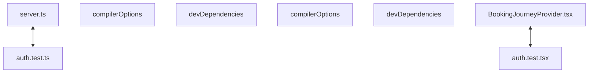

# Codebase Architectural Report

> **Auto-generated** by graphify knowledge graph analysis  
> **Purpose**: Dependency map, connection analysis, subsystem breakdown, and quality hotspots.

---

## 1. Executive Summary

- **Total Components**: `195`
- **Total Connections**: `243`
- **Subsystem Modules**: `1`
- **Dependency Types**: `9`

**Key Architectural Hubs:**

| # | Component | File | Type | Connections |
|---|-----------|------|------|-------------|
| 1 | `server.ts` | `backend/src/server.ts` | file | 15 |
| 2 | `compilerOptions` | `frontend/tsconfig.json` | function | 15 |
| 3 | `auth.test.tsx` | `frontend/tests/auth.test.tsx` | function | 12 |
| 4 | `devDependencies` | `backend/package.json` | function | 11 |
| 5 | `compilerOptions` | `backend/tsconfig.json` | function | 11 |
| 6 | `devDependencies` | `frontend/package.json` | function | 11 |
| 7 | `BookingJourneyProvider.tsx` | `frontend/state/BookingJourneyProvider.tsx` | class | 11 |
| 8 | `auth.test.ts` | `backend/tests/auth.test.ts` | file | 10 |

---

## 2. Dependency & Connection Analysis

### Relationship Types

| Relationship | Count | Share |
|-------------|-------|-------|
| `contains` | 120 | 49% |
| `imports` | 59 | 24% |
| `imports_from` | 26 | 11% |
| `extends` | 12 | 5% |
| `calls` | 9 | 4% |
| `method` | 7 | 3% |
| `references` | 6 | 2% |
| `indirect_call` | 2 | 1% |
| `conceptually_related_to` | 2 | 1% |

### Hub Dependency Diagram

### Most Connected Pairs

| Component A | Component B | Shared Connections |
|-------------|-------------|-------------------|
| `build` | `scripts` | 2 |
| `dev` | `scripts` | 2 |
| `scripts` | `start` | 2 |
| `scripts` | `test` | 2 |
| `@types/node` | `devDependencies` | 2 |
| `devDependencies` | `typescript` | 2 |
| `devDependencies` | `vitest` | 2 |
| `@types/node` | `@types/node` | 2 |
| `typescript` | `typescript` | 2 |
| `vitest` | `vitest` | 2 |

---

## 3. Subsystem & Module Breakdown

### 3.1 backend
**Nodes**: `195`  
**Files**: `.engine/memory/progress_summary.md`, `.engine/workers/df7ba8910e0c/memory/progress_summary.md`, `.engine/workers/df7ba8910e0c/scratch/findings.md`, `backend/package.json`, `backend/src/config.ts`, `backend/src/db/database.ts` +21 more

| Component | Type | File | Connections |
|-----------|------|------|-------------|
| `server.ts` | file | `backend/src/server.ts` | 15 |
| `compilerOptions` | function | `frontend/tsconfig.json` | 15 |
| `auth.test.tsx` | function | `frontend/tests/auth.test.tsx` | 12 |
| `devDependencies` | function | `backend/package.json` | 11 |
| `compilerOptions` | function | `backend/tsconfig.json` | 11 |
| `devDependencies` | function | `frontend/package.json` | 11 |
| `BookingJourneyProvider.tsx` | class | `frontend/state/BookingJourneyProvider.tsx` | 11 |
| `auth.test.ts` | file | `backend/tests/auth.test.ts` | 10 |
| `api.ts` | file | `frontend/lib/api.ts` | 10 |
| `AuthService` | class | `backend/src/services/authService.ts` | 9 |

---

## 4. API Reference

Public classes and functions by subsystem.

### backend

| Name | Type | File | Connections |
|------|------|------|-------------|
| `compilerOptions` | function | `frontend/tsconfig.json` | 15 |
| `auth.test.tsx` | function | `frontend/tests/auth.test.tsx` | 12 |
| `devDependencies` | function | `backend/package.json` | 11 |
| `compilerOptions` | function | `backend/tsconfig.json` | 11 |
| `devDependencies` | function | `frontend/package.json` | 11 |
| `BookingJourneyProvider.tsx` | class | `frontend/state/BookingJourneyProvider.tsx` | 11 |
| `AuthService` | class | `backend/src/services/authService.ts` | 9 |
| `dependencies` | function | `backend/package.json` | 8 |

---

## 5. Code Quality & Architectural Risk Hotspots

### Component Type Distribution

| Type | Count | Share |
|------|-------|-------|
| function | 131 | 67% |
| class | 29 | 15% |
| method | 21 | 11% |
| file | 14 | 7% |

### Dependency Cycles

**56** circular dependency loop(s) detected:

| # | Cycle Path |
|---|-----------|
| 1 | `frontend_state_bookingjourneyprovider → frontend_state_bookingjourneyprovider_bookingjourneyprovider → frontend_tests_auth_test` |
| 2 | `frontend_state_bookingjourneyprovider → frontend_app_layout → frontend_state_bookingjourneyprovider_bookingjourneyprovider` |
| 3 | `frontend_components_loginform → frontend_state_bookingjourneyprovider → frontend_tests_auth_test` |
| 4 | `frontend_components_otpform → frontend_state_bookingjourneyprovider → frontend_tests_auth_test` |
| 5 | `frontend_lib_api → frontend_state_bookingjourneyprovider → frontend_tests_auth_test` |
| 6 | `frontend_components_loginform → frontend_state_bookingjourneyprovider_usebookingjourney → frontend_state_bookingjourneyprovider` |
| 7 | `frontend_components_loginform_loginform → frontend_state_bookingjourneyprovider_usebookingjourney → frontend_state_bookingjourneyprovider → frontend_tests_auth_test` |
| 8 | `frontend_components_otpform → frontend_state_bookingjourneyprovider_usebookingjourney → frontend_state_bookingjourneyprovider` |
| 9 | `frontend_components_otpform_otpform → frontend_state_bookingjourneyprovider_usebookingjourney → frontend_state_bookingjourneyprovider → frontend_tests_auth_test` |
| 10 | `frontend_lib_api_authuser → frontend_state_bookingjourneyprovider_bookingjourneystate → frontend_state_bookingjourneyprovider` |

### Orphaned Components

**2** isolated node(s) with no connections:

| Component | File |
|-----------|------|
| `auth.spec.ts` | `frontend/e2e/auth.spec.ts` |
| `SQLite Native Binding Blocker` | `.engine/workers/df7ba8910e0c/memory/progress_summary.md` |

---

## 6. How to Navigate

1. **Interactive D3 Map** — open `graph.html` to explore node connections visually.
2. **Knowledge Graph Queries** — use MCP tools (`graph_query`, `graph_explain_node`, `graph_impact_radius`).
